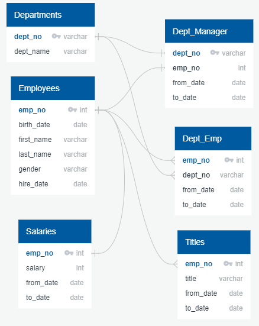
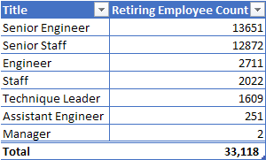

<h1>
Pewlett Hackard Employee Database | Technical Analysis
</h1>
<h2>Mapping Out the Database</h2>
<h3>⋮ The Entity Relationship Diagram ⋮</h3>

> Each SQL table in the ERD holds key information from the datafiles Pewlett Hackard provided at the beginning of the project. The design of the diagram, including its *flowchart characteristics*, are used to help understand and visualize the relationships between the SQL tables.

<h2>Project Summary</h2>
<h3>⋮ Objective ⋮</h3>

The objective is to answer, identify, and provide visualizations for the following:

1. How many roles will need to be filled as the "silver tsunami"[^1] begins to make an impact?

2. Identify retirement-ready employees who qualify to mentor the next generation of Pewlett Hackard employees.

[^1]: The "silver tsunami" referrs to a wave of employees that retire from the company within a short period of time.

<h3>⋮ Results ⋮</h3>

To get the Number of Retiring Employees by Title, I created three new tables, one showing the number of *titles* retiring, one showing number of employees with each title, and one showing a list of current employees born between Jan. 1, 1952 and Dec. 31, 1955. Because some employees had switched titles over the years, duplicates were present in the table. Since Postgres doesn't have a simple function that can identify which rows are duplicated, I used partitioning to remove duplicates from the dataset. This was a challenge, but it allowed me to use my *mad search engine skills* to find more detail on how to resolve the problem and carry out the partitioning process.

> There are 33,118 current employees elegible to retire.

To determine who qualified to to mentor the next generation of Pewlett Hackard employees, I created a new table that only included employees with a date of birth falling between Jan. 1, 1965 and Dec. 31, 1965. The data in the table included Employee number, First and last name, Title, from_date and to_date. Two inner joins were used to filter out the qualified employees.

> There are 2,382 retirment-ready employees who qualify for a [mentorship role.](https://github.com/sierrah154/Pewlett-Hackard-Analysis/blob/master/Challenge/Data/mentorship.csv)

<h3>Further Analysis and Recommendations</h3>

Another piece to the Database the company may want to concider analyzing, is to find out who is actually going to retire, since some people that are eligible may chose to continue working. Another piece that would be helpful for deciding elibility for promotions or leadership roles as new employees are hired, would be to create a table with the number of years each current employee has been with the company, and even more specifically, within a certain role or department.
